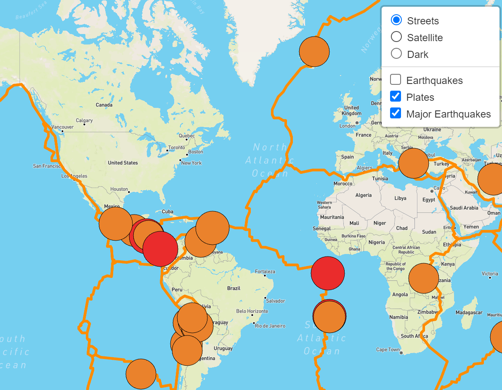

# Mapping_Earthquakes

## Overview

We can utilize Maps for various purposes such as making business decisions and understanding geographical phenomena. Using javascript (GeoJSON) we create interactive maps to visualize earthquake data and show magnitudes all over the world for the last seven days. We employ our data by accessing the [USGS website](https://www.usgs.gov/natural-hazards/earthquake-hazards/earthquakes) and add to our map. The Magnitude of the earthquake is indicated by its marker size and color. The fault lines of the platelets on our map make it clear that most major earthquakes occur on the edges of these tectonic plates. One can see only the major Earthquakes by having only the Plates and Major Earthquakes overlays toggled on.

